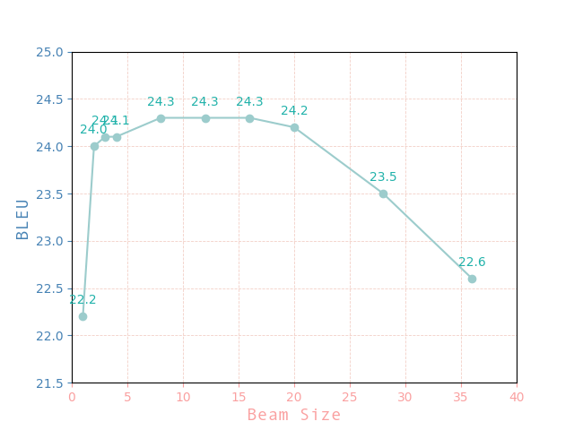

# MT Exercise 5: Byte Pair Encoding, Beam Search

This repo is just a collection of scripts showing how to install [JoeyNMT](https://github.com/joeynmt/joeynmt), download
data and train & evaluate models.

# Requirements

- This only works on a Unix-like system, with bash.
- Python 3 must be installed on your system, i.e. the command `python3` must be available
- Make sure virtualenv is installed on your system. To install, e.g.

    `pip install virtualenv`

# Steps

🧑‍🤝‍🧑 Clone this repository in the desired place:

    git clone https://github.com/nneva/mt-exercise-5

💻 Create a new virtualenv that uses Python 3. Please make sure to run this command outside of any virtual Python environment:

    ./scripts/make_virtualenv.sh

**Important**: Then activate the env by executing the `source` command that is output by the shell script above.

🛠️ Download and install required software:

    ./scripts/download_install_packages.sh

pip install for `PyYAML` is added.

⬇️ Download data:

    ./download_iwslt_2017_data.sh

The data is only minimally preprocessed, so you may want to tokenize it and apply any further preprocessing steps.

✂️ Preprocess data:

    ./scripts/preprocess.sh

This command creates directory `samples` and stores dev and test data in it. 

It also executes `subsample.py`, which subsamples originally downloaded train data based on the desired number of lines, and stores them also in `samples` directory. 

Train, dev and test data are tokenized with Moses Tokenizer. 

🤸 Train a word level model:

    ./scripts/train.sh

The training process can be interrupted at any time, and the best checkpoint will always be saved.

🤸 Train BPE level models:

    ./scripts/train_bpe.sh

By running this script BPE is learned and applied, and respective vocabulary is built prior to start of the training. 

To initialize the training with different vocab size, change the `bpe_num_operations` value in this script.

This will automatically load different configuration, if such is present in configs directory, and named properly.

See configurations in configs directory for more details.

📝 Evaluate a trained word level model with:

    ./scripts/evaluate.sh

This script will create directory `translations`, with the subdirectory named after the model.

Post-processing steps include detokenization of the test data.

Results of the evaluation will be printed out in the terminal.

📝 Evaluate trained BPE level models with:

    ./scripts/evaluate_bpe.sh

To evaluate different BPE level models, change `model_name` in this script accordingly.

This script will create additional subdirectorie(s) named after the model(s), where translations are stored.

Post-processing steps include detokenization and removal of BPE from the test data.

Results of the evaluation will be printed out in the terminal.

If you decide to train and evaluate several BPE level models, make sure to run `train_bpe.sh` then `evaluate_bpe.sh` for the same model before initializing training of the next BPE level model.

💫 To get BLEU results for different `beam size` values run:

    .scripts/vary_beam_size.sh | tee -a bleu_output.txt

This script executes `parse_yaml.py` which takes as inputs path to the desired config file and `K` (**beam size**) values as defined in `scripts/vary_beam_size.py`. For every newly entered `K` value, the script will automatically generate respective configuration in .yaml format and replace with it already existing one.

The script contains 10 different `K` values.

Further, the script will call `evaluate_bpe.sh` to evaluate translation automatically for every newly entered `K` using `BLEU` as evaluation metric.

Raw results of the performed evaluation for all `K` values can be found in `bleu_output.txt`.

📈 To get graph for BLEU - BEAM SIZE run:

    python scripts/get_graph.py

# Experiment Results

- Translation direction: DE --> EN

- Detailed analysis of the results will be submitted in PDF.

**1 Byte Pair Encoding**

|                   |    `use BPE`  |    vocab size   |     `BLEU`     | 
|:------------------|:-------------:|:---------------:|---------------:|
|        (a)        |      `no`     |      2000       |     `13.8`     |
|        (b)        |      `yes`    |      2000       |     `20.7`     |            
|        (c)        |      `yes`    |      12000      |     `24.0`     |
  

**1.1 BLEU - Differences**

Experiment confirms that "subword representations cause big improvements in the translation of rare and unseen words"(Sennrich et al. ***"Neural Machine Translation of Rare Words with Subword Units"***) contributing to the overall better evaluation scores. The most significant improvement is observed in a difference between BLEU scores of a word-level model and BPE-level model with the same vocabulary size of 2000 tokens/subwords. 

**1.2 Manual Assessment**

In order to make assessment fair on a level of the machine output, and since "human raters assessing adequacy and fluency show a stronger preference for human over machine translation when evaluating documents as compared to isolated sentences" (Läubli et al. ***"Has Machine Translation Achieved Human Parity?"*** ), assessment is performed on 15 randomly chosen isolated sentence pairs.

**2 Beam Size & Translation Quality**

The relationship graph between BLEU score and beam size roughly corresponds to the idea that "increasing the beam size does not consistently improve translation quality." (Kohen & Knowels - ***"Six Challenges for Neural Machine Translation"***). Based on this specific case optimal beam size is between 8 and 16.  

